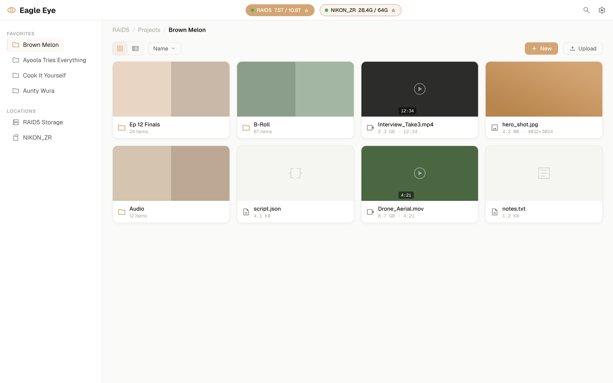

# Eagle Eye

A web-based file manager for personal NAS, powered by [CopyParty](https://github.com/9001/copyparty). Canva-inspired file browsing, media preview, and OS-like drive management.



## Features

- **Canva-style file cards** with thumbnail previews (grid + list view)
- **Video hover preview** — 500ms delay, muted loop on hover
- **Image lightbox** with keyboard navigation (arrow keys, Escape)
- **Video player** overlay with streaming playback
- **RAW thumbnail support** for camera files (including `.NEF`) when backend tools are installed
- **Graceful RAW video fallback** for proprietary codecs like `.R3D` (icon + hint)
- **Drive management** — mount/eject removable storage (SD cards, USB drives)
- **Drag & drop upload** with progress
- **File operations** — create folders, text files, rename, delete
- **Search** across your file library
- **System-adaptive** light/dark theme
- **Mobile responsive** with slide-out sidebar
- **Docker Compose** deployment — one command to start

## Quick Start

```bash
git clone https://github.com/salakoayoola/eagle-eye.git
cd eagle-eye
./install.sh
```

Or manually:

```bash
cp .env.example .env
# Edit .env — set DATA_DIR to your files directory
docker compose up -d
# Open http://localhost:8080
```

## Architecture

```
Eagle Eye (React + shadcn/ui)    ← Frontend (nginx)
Companion API (Hono)             ← Drive mount/eject (optional)
CopyParty                        ← File operations backend
```

- **Frontend:** React 19, Vite, TypeScript, Tailwind CSS, shadcn/ui, TanStack Query
- **Companion API:** Hono on Node.js — thin layer for drive mount/unmount/eject
- **File backend:** CopyParty handles all file operations (list, upload, download, rename, delete, move, mkdir, search, thumbnails, streaming)
- **Deployment:** Docker Compose with nginx reverse proxy

## Media Preview Notes

- `.mp4`: thumbnail + hover playback works via CopyParty/ffmpeg.
- `.nef` (and other RAW images): Eagle Eye now requests thumbnails for RAW image types. The bundled CopyParty image includes `exiftool`, `libraw-tools`, and `imagemagick` for better RAW thumbnail coverage.
- `.r3d` / `.braw` / `.ari`: these codecs need proprietary SDKs; Eagle Eye falls back to icon preview and metadata when decoding is unavailable.

## Configuration

Copy `.env.example` to `.env` and adjust:

| Variable | Default | Description |
|----------|---------|-------------|
| `DATA_DIR` | `./data` | Directory to serve files from |
| `EAGLE_EYE_PORT` | `8080` | Web interface port |
| `COPYPARTY_PORT` | `3923` | CopyParty backend port |
| `COMPANION_PORT` | `3924` | Companion API port |
| `MEDIA_MOUNT_DIR` | `/mnt/media` | Where removable drives mount (Linux) |

## Drive Management (Optional)

Drive management requires the companion API and is Linux-only. Start with the `drives` profile:

```bash
docker compose --profile drives up -d
```

The companion API needs privileged access to mount/unmount drives. It calls system scripts at configurable paths (`MOUNT_SCRIPT`, `UNMOUNT_SCRIPT`).

## Development

```bash
# Frontend
cd client
npm install
npm run dev

# Companion API
cd server
npm install
npm run dev
```

Set `VITE_COPYPARTY_URL` to point at your CopyParty instance for local development.

## Design

- Amber/gold accent (#D4A574) — no blue
- Warm gray neutrals
- Geist (body/UI) + Satoshi (display) + Geist Mono (data) typography
- See [DESIGN.md](DESIGN.md) for the full design system

## License

MIT
